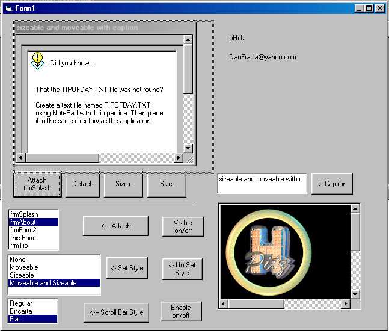

<div align="center">

## Subforms in VB UPDATED


</div>

### Description

Subforms in VB UPDATED!!!!

This OCX allows you to set any one form in your project as a parent form and display all other forms within the project as a subform within a client area of the parent form. A demo client project within a .vbg is included (run_this.vbg). Register the .ocx using regsvr32 first.

Major news:

User control with CAPTION

User control MOVEABLE at runtime

User control SIZEABLE at runtime

Change the ATTACHED Window Style

Event GetAttachedWindowStyle(ByRef NewStyle As Long)

(you can set your own Attached Window Style)

Event NewStyle(ByVal PropertyName As String, ByVal newValue As Boolean)
 
### More Info
 
Seven Interface Definition

General Information

Library:	Seven (Seven)

File:	SUBFORMCTL\Seven.ocx

Version:	1.1.0

Enumerations

This section lists enumerations exposed by Seven.

Public Enum EMsgResponse

emrConsume=0

emrPostProcess=1

emrPreprocess=2

End Enum

Public Enum ScrollStyleConstants

efsRegular=0

efsEncarta=1

efsFlat=2

End Enum

Public Enum sfAttachedWindowStyle

sfOriginalStyle=0

sfSubformStyle=1

sfCustomStyle=2

End Enum

Interfaces

This section lists the Classes exposed by Seven. For each class, the methods and events are listed.

SubForm

Methods

Sub AttachForm(ByVal frm As Object, Optional ByVal AttachedWindowNewStyle As sfAttachedWindowStyle=1) -update

Sub DetachForm

Function isEmpty() As Boolean

Property Get Moveable() As Boolean - new

Property Let Moveable(RHS As Boolean) - new

Property Get Sizeable() As Boolean - new

Property Let Sizeable(RHS As Boolean) - new

Property Get Caption() As String - new

Property Let Caption(RHS As String) - new

Property Get ScrollBarStyle() As ScrollStyleConstants

see Steve McMahon (steve@dogma.demon.co.uk) cScrollBars

Property Let ScrollBarStyle(RHS As ScrollStyleConstants)

see Steve McMahon (steve@dogma.demon.co.uk) cScrollBars

Property Get Enabled() As Boolean

Returns/sets a value that determines whether an object can respond to user-generated events.

Property Let Enabled(RHS As Boolean)

Returns/sets a value that determines whether an object can respond to user-generated events.

Property Get BackColor() As ULong

Returns/sets the background color used to display text and graphics in an object.

Property Let BackColor(RHS As ULong)

Returns/sets the background color used to display text and graphics in an object.

Property Get Picture() As Picture

Returns/sets a graphic to be displayed in a control.

Property Set Picture() As Picture

Returns/sets a graphic to be displayed in a control.

Events

Public Event AfterAttach(ByVal FormName As String, ByVal FormWidth As Long, ByVal FormHeight As Long)

Public Event Scroll(ByVal isHorizontalBar As Boolean)

Public Event ScrollBarChange(ByVal isHorizontalBar As Boolean) -update

Public Event GetAttachedWindowStyle(ByVal NewStyle As Long) -new

Public Event NewStyle(ByVal PropertyName As String, ByVal newValue As Boolean) -new

GSubclass

Methods

Sub AttachMessage(ByVal iwp As _ISubclass, ByVal hwnd As Long, ByVal iMsg As Long)

Start subclassing for a particular message.

Sub DetachMessage(ByVal iwp As _ISubclass, ByVal hwnd As Long, ByVal iMsg As Long)

Stop subclassing for a particular message.

Property Get CurrentMessage() As Long

Returns the message currently being worked on. Only valid in the MsgResponse and WindowProc items of your implemented interface.

Function CallOldWindowProc(ByVal hwnd As Long, ByVal iMsg As Long, ByVal wParam As Long, ByVal lParam As Long) As Long

Calls the window procedure for this handle which was installed before you added the subclass.

Events

None

ISubclass

Methods

Property Get MsgResponse() As EMsgResponse

Get/set how you will respond to a message. Raised whenever a message is encountered. Call the CurrentMessage property to determine what message you are currently responding to.

Property Let MsgResponse(RHS As EMsgResponse)

Get/set how you will respond to a message. Raised whenever a message is encountered. Call the CurrentMessage property to determine what message you are currently responding to.

Function WindowProc(ByVal hwnd As Long, ByVal iMsg As Long, ByVal wParam As Long, ByVal lParam As Long) As Long

Raised whenever a message you have subclassed is sent.

Events

None


<span>             |<span>
---                |---
**Submitted On**   |2001-07-02 12:17:06
**By**             |[Dan Mircea Fratila](https://github.com/Planet-Source-Code/PSCIndex/blob/master/ByAuthor/dan-mircea-fratila.md)
**Level**          |Advanced
**User Rating**    |4.9 (34 globes from 7 users)
**Compatibility**  |VB 6\.0
**Category**       |[Custom Controls/ Forms/  Menus](https://github.com/Planet-Source-Code/PSCIndex/blob/master/ByCategory/custom-controls-forms-menus__1-4.md)
**World**          |[Visual Basic](https://github.com/Planet-Source-Code/PSCIndex/blob/master/ByWorld/visual-basic.md)
**Archive File**   |[Subforms i22057722001\.zip](https://github.com/Planet-Source-Code/dan-mircea-fratila-subforms-in-vb-updated__1-23108/archive/master.zip)

### API Declarations

```
Private Const GWL_STYLE = (-16)
Private Const WS_CAPTION = &HC00000 ' WS_BORDER Or WS_DLGFRAME
Private Const WS_SYSMENU = &H80000
Private Const WS_THICKFRAME = &H40000
Private Const WM_SETTEXT = &HC
Private Const WM_MOVE = &H3
Private Const WM_SIZE = &H5
Private Const WM_SIZING = &H214
Private Type RECT
 left As Long
 top As Long
 right As Long
 bottom As Long
End Type
Private Type SIZE
 cX As Long
 cY As Long
End Type
Private Enum ESetWindowPosStyles 'Slimy Windows Hacks'
 SWP_SHOWWINDOW = &H40
 SWP_HIDEWINDOW = &H80
 SWP_FRAMECHANGED = &H20 ' The frame changed: send WM_NCCALCSIZE
 SWP_NOACTIVATE = &H10
 SWP_NOCOPYBITS = &H100
 SWP_NOMOVE = &H2
 SWP_NOOWNERZORDER = &H200 ' Don't do owner Z ordering
 SWP_NOREDRAW = &H8
 SWP_NOREPOSITION = SWP_NOOWNERZORDER
 SWP_NOSIZE = &H1
 SWP_NOZORDER = &H4
 SWP_DRAWFRAME = SWP_FRAMECHANGED
 HWND_NOTOPMOST = -2
End Enum
Private Declare Function SetParent Lib "user32" (ByVal hWndChild As Long, ByVal hWndNewParent As Long) As Long
Private Declare Function GetWindowRect Lib "user32" (ByVal hwnd As Long, lpRect As RECT) As Long
Private Declare Function GetClientRect Lib "user32" (ByVal hwnd As Long, lpRect As RECT) As Long
Private Declare Function MoveWindow Lib "user32" (ByVal hwnd As Long, ByVal X As Long, ByVal Y As Long, ByVal nWidth As Long, ByVal nHeight As Long, ByVal bRepaint As Long) As Long
Private Declare Function GetWindowLong Lib "user32" Alias "GetWindowLongA" (ByVal hwnd As Long, ByVal nIndex As Long) As Long
Private Declare Function SetWindowLong Lib "user32" Alias "SetWindowLongA" (ByVal hwnd As Long, ByVal nIndex As Long, ByVal dwNewLong As Long) As Long
Private Declare Function SetWindowPos Lib "user32" (ByVal hwnd As Long, ByVal hWndInsertAfter As Long, ByVal X As Long, ByVal Y As Long, ByVal cX As Long, ByVal cY As Long, ByVal wFlags As Long) As Long
Private Declare Sub CopyMemory Lib "kernel32" Alias "RtlMoveMemory" (Destination As Any, Source As Any, ByVal Length As Long)
Private Declare Function SendMessage Lib "user32" Alias "SendMessageA" (ByVal hwnd As Long, ByVal wMsg As Long, ByVal wParam As Long, lParam As Any) As Long
```


